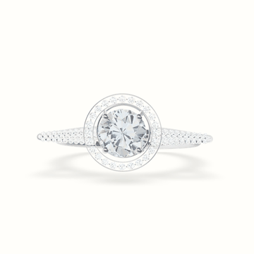
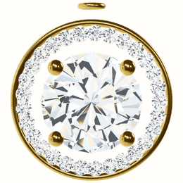
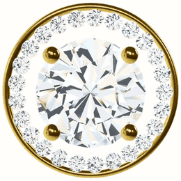
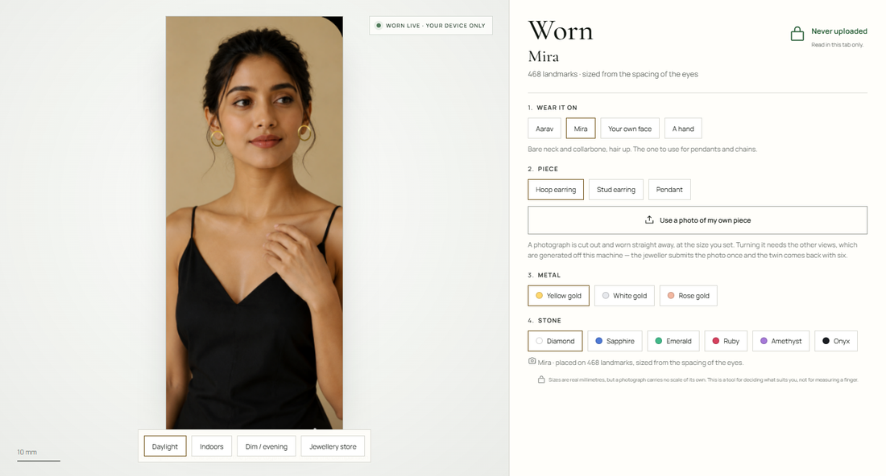

# Aurelia Antlers

**A jeweller's catalogue of digital twins you can turn, and a customer trying them on through their own camera.**

### ▶ [Try it live](https://aurelia-antlers.jwelery-ecommerce.workers.dev)

Turn a piece, then open your camera and wear it. Nothing is uploaded.

No server. No API keys. No GPU required. Everything runs in the browser, and the camera never uploads a frame.

<p align="center">
  
  
  
</p>

<p align="center">
  
</p>

---

## Two things, and nothing else

1. **Pieces you can turn** — 24 baked views per metal and stone, dragged like a product spinner.
2. **Try it on** — open the camera and the selected piece lands on your hand, ears or neck. Or upload a photograph and wear it there.

The piece drawn on the customer is always the piece the jeweller published — the same asset, cut out of the same bake — never a stand-in that resembles it. That is the whole promise, so it is enforced as a rule rather than left as a preference.

## The idea it rests on

**Virtual try-on does not require reconstructing the person.** MediaPipe FaceMesh returns 468 3D landmarks with a triangulation — an actual mesh of the user's face, in-browser, in about a second, free. Earrings and pendants anchor to fixed indices on it; a hand landmarker does the same for rings. No training, no scan, no server, no GPU.

So the person is solved geometry, and the remaining work is materials and light. Gold and gemstones have almost no diffuse colour of their own — what you see in them is the environment reflected. "How does this look in daylight versus a shop" is therefore not a filter over the render; it *is* the difference between two renders, and it is the question customers actually have.

## What was hard

The interesting parts of this project were all cases where the obvious answer is wrong. A few, with what the measurement showed:

**A baked frame is not a worn asset.** A turntable frame is a square with the piece somewhere inside it and a wide transparent margin. Hand that to the camera, tell it the piece is 19 mm, and it draws the *whole square* 19 mm wide — so the ring comes out a third too small. The pipeline crops to the piece and records what the resulting square is worth.

**A chain cannot be cut away from its pendant by any stencil.** It hangs in an arc whose ends come down *beside* the drop, level with it, so no horizontal cut exists. Thickness-based morphological opening works on one frame and fails across a turn — a chain seen end-on is foreshortened thick enough to survive, and the same opening eats a transparent stone. The answer was to stop cutting: the renderer draws the drop without its chain, because in the scene they were always separate objects.

**Two unit conventions, both correct.** The catalogue models are authored at display scale; anything that has to sit on a person is authored in metres at real-world size. Mixing them is silent and looks like anything but a scale error — a metres-authored piece dropped into the render route baked almost black, because a shadow camera framed for 3.7 units resolves nothing across 0.024. The same collision hit the gem materials separately, since transmission distance is evaluated in world units.

**Fingertips are the worst landmarks on a hand.** Thumb-to-index works as a *pinch* detector and is hopeless as a *rotation* signal: forty degrees of travel on the two noisiest points the model returns. Rotation comes off wrist-to-knuckle.

**MediaPipe needs WebGL2 whatever `delegate` says.** `delegate: 'CPU'` constructs fine and then dies inside `detect()` with a WebGL error, three seconds after a 15 MB download. The app probes up front and says so in a sentence a person can act on.

Full engineering notes, including the mistakes, are in [`CLAUDE.md`](CLAUDE.md).

## Run it

```bash
npm install
npm run dev
```

Chrome, Edge, Firefox or Safari with hardware acceleration on. The camera opens only when you press the button.

## How a piece gets into the catalogue

Nothing runs at request time. Every asset is baked offline and committed.

| Source | Views | Turns | Metal/stone | Cost |
|---|---|---|---|---|
| Modelled in three.js | 24 × 2 tiers | yes | every combination | build the mesh |
| Photographed on a turntable | as many as you shoot | yes | one, as shot | own the piece |
| Zero123++ from one photo | 6 fixed | coarsely | one | a free GPU run |
| One photo, cut out | 1 | rotates only | one | instant, in-browser |

`src/turntable.tsx` is an offscreen render route that the bake scripts photograph, so a spinner can never drift from what the live viewer shows — same mesh, same materials, same HDRI. For a piece that only exists as a photograph, `tools/multiview/twin.py` is one command: crop and matte, run Zero123++ on a free Kaggle GPU, install six views, register the piece. No hand-written file is edited to add one.

## Stack

React 19 · Vite 6 · three.js (vendored) · @react-three/fiber · MediaPipe Tasks Vision (vendored) · Canvas 2D · Python + Pillow for the asset pipeline

Nothing is loaded from a CDN. The 2D compositor exists so the whole try-on still works on a machine that gives the page no WebGL context at all — which is the machine this was developed on.

## What it does not do

- A single photograph carries no data for the sides of a head, so the orbit is fenced rather than pretending otherwise.
- Sizes are real millimetres, but every scale comes from a population average — interpupillary distance for a face, knuckle span for a hand. This shows whether a piece suits you. It is not a measuring tool, and the UI says so.
- A ring is not drawn on a *live* finger. Twenty-one hand landmarks carry no wrist roll and no finger thickness, so a band on a moving finger floats beside it. Rings are worn on a photograph, and held in the air on camera.
- Zero123++ gives six fixed poses at 320 px with no elevation axis, and it fails on flat face-on product shots. Input pose matters far more than background.
